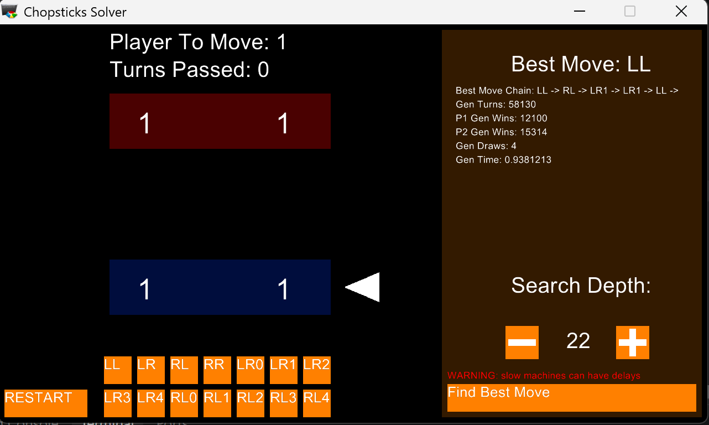

# Chopsticks_Bot
Ruby minimax bot for turn-based game for Intro to Programming unit. This program was made to investigate the real-life problem of whether player one could win when the game is played perfectly.

## Installation
Clone or download
Using Ruby 3.3.7
Run "ruby Program.rb"
Display scaling can cause the window to appear extremely small. To fix:
1. Open the properties of the ruby.exe installation file
2. Open the combaitbility tab
3. Click Change high DPI settings
4. Tick "Override high DPI scaling behaviour"

## Rules
- Players can either attack from one hand to an opponent's hand, or transfer between their hands. This uses their turn
- When attacking, the ammount of fingers on the recieving hand is increased by the amount of fingers on the attacking hand
- When transferring, players can chose the amount to be moved from one hand to another
- When one hand reaches 5 or higher, they go back to 0 and cannot be involved in attacking (including being attacked), or transfering
- A player wins the game when their opponent has 0 fingers on both hands
- For the sake of the best move algorithm, repeating patterns such as indefinitely transferring cannot be made

## Controls
### Game
- Use the RESTART button to restart the game
- Use the first 4 buttons to attack. LR = "Attack left hand to right hand"
- Use the last 10 buttons to transfer. LR3 = "Transfer 3 fingers from left hand to right hand"

### AI / Best Move Search
- Use the plus and minus buttons to change the search depth. A depth of 22 gives the longest game possible
- Use the "Find Best Move" button to calculate the best move. The search results and stats will display in the top right of the screen